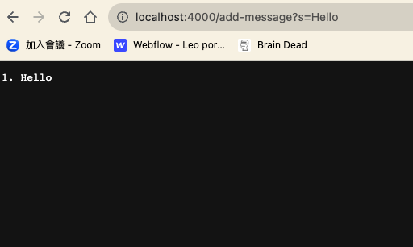
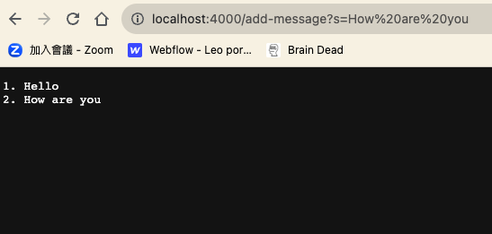

#Lab Report 2

##Part1
**Code for StringServer**
```
import java.io.IOException;
import java.net.URI;

class Handler implements URLHandler {
    int num = 1;
    String info = "";

    public String handleRequest(URI url) {
        if (url.getPath().equals("/")) {
            return String.format("String Server Running", num);
        } else {
            if (url.getPath().contains("/add-message")) {
                String[] parameters = url.getQuery().split("=");
                if (parameters[0].equals("s")) {
                    info += num + ". " +  parameters[1] + "\n";
                    num ++;
                    return String.format(info);
                }
            }
            return "404 Not Found!";
        }
    }
}

class StringServer {
    public static void main(String[] args) throws IOException {
        if(args.length == 0){
            System.out.println("Missing port number! Try any number between 1024 to 49151");
            return;
        }

        int port = Integer.parseInt(args[0]);

        Server.start(port, new Handler());
    }
}
```

#### `handleRequest` Method
Method handles incoming HTTP requests based on the path of the URI.

- If the path is `/`, it returns `"String Server Running"`.
- If the path contains `/add-message`, it processes the query parameters to add a message to the `info` field and returns the updated messages.
- For any other path, it returns `"404 Not Found!"`.

### Usage and Field Changes with /add-message

When the `/add-message` endpoint is called with a query parameter like `?s=Hello`:

#### Method Calls:
- `handleRequest(URI url)`: This method is called with a `URI` object representing the new URI("http://localhost:4000/add-message?s=Hello").

#### Arguments and Values:
- `url`: A `URI` object representing the URL `"http://localhost:4000/add-message?s=Hello"`.
- `num`: Initially 1
- `info`: Initially ""

#### Field Changes:
- `info`: This field will concatenate the current value of `num`, the received message, and a newline character. If the initial value was "" and `num` was 1, it becomes `"1. Hello\n"`.
- `num`: This field increments by 1.



#### Second Call Method
The second call to `/add-message?s=How%20are%20you`, will have the same method called describe above but different URI object.

#### Initial Values and Parameters
- `url`: A `URI` object representing the URL `"http://localhost:4000/add-message?s=How%20are%20you"`.
- `num`: 2
- `info`: "1. Hello\n"
  
#### Field Changes:
- `info`: Concatenates `"2. How are you\n"` to the existing messages, becoming `"1. Hello\n2. How are you\n"`.
- `num`: Increments to 3.

